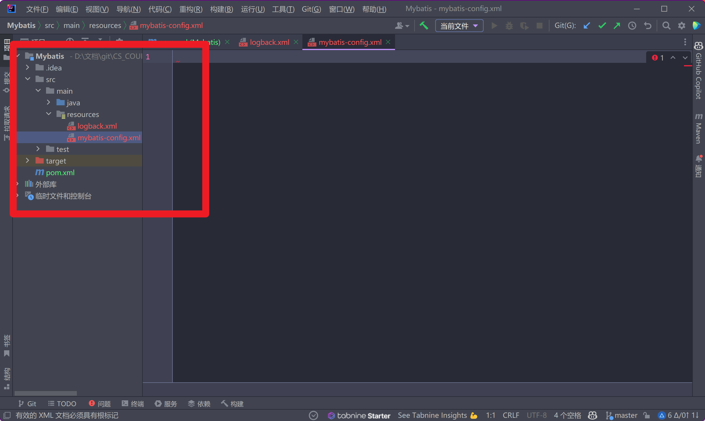
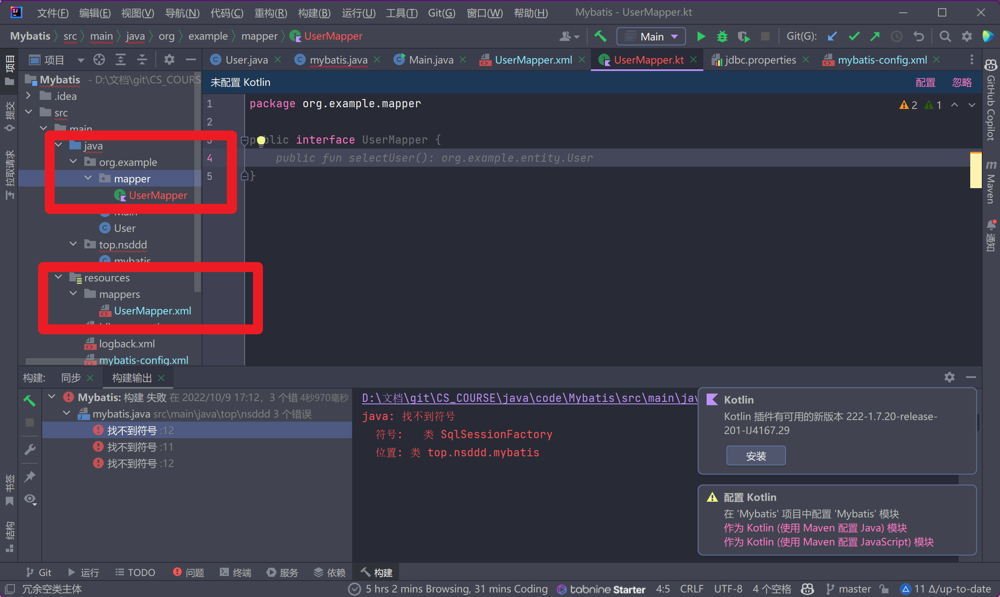

+ [author](https://github.com/3293172751)
+ <a href="https://github.com/3293172751" target="_blank"></a></p>

# 第32节 Mybatis入门

+ [回到目录](../README.md)
+ [回到项目首页](../../README.md)
+ [上一节](31.md)
> ❤️💕💕java的学习指南,从入门到大师篇章。Myblog:[http://nsddd.top](http://nsddd.top/)
---
[TOC]

::: warngin 提醒
 📚这篇主要是讲解篇，对步骤和`mybatis`架构的讲解，如果不需要可以直接跳到下一篇

 📮下一篇是`mybatis`的配置文件直接导入就好~

:::


## mybatis是什么？

+ [x] [官方文档](https://mybatis.org/mybatis-3/zh/index.html)

`mybatis`是一款优秀的持久性框架，用于简化`JDBC`开发

> JDBC缺点：
>
> 1. 硬编码（修改麻烦 – 将代码写死）
>    + 注册驱动，获取链接
>    + sql语句
> 2. 操作繁琐
>    + 手动设置参数
>    + 手动封装结果集

`Javaee`三层架构：

+ 表现层
+ 业务层
+ 持久层

> mysql环境：mysql安装的是新版的，是docker拉取的。


## 框架是什么？

框架是一个半成品软件，是一套可重用的、通用的、软件基础代码模型

在框架基础之上构建软件编写更加高效、规范、通用、可扩展

> 就是用少量的工作实现一个复杂的业务
>
> `mybatis`免除了几乎所有的`JDBC`代码以及设置参数和获取结果集的工作。


## mybabis框架介绍

+ mybatis是一个持久层的框架，是apache下的顶级项目。

  mybatis托管到goolecode下，再后来托管到github下(https://github.com/mybatis/mybatis-3/releases)。

+ mybatis让程序将主要精力放在sql上，通过mybatis提供的映射方式，自由灵活生成（半自动化，大部分需要程序员编写sql）满足需要sql语句。

+ mybatis可以将向 preparedStatement中的输入参数自动进行输入映射，将查询结果集灵活映射成java对象。（输出映射）


## mybabis快速入门

1. 配置mybatis的配置文件，SqlMapConfig.xml（名称不固定）

2. 通过配置文件，加载mybatis运行环境，创建SqlSessionFactory会话工厂(SqlSessionFactory在实际使用时按单例方式)

3. 通过SqlSessionFactory创建SqlSession。SqlSession是一个面向用户接口（提供操作数据库方法），实现对象是线程不安全的，建议sqlSession应用场合在方法体内。

4. 调用sqlSession的方法去操作数据。如果需要提交事务，需要执行SqlSession的commit()方法。

5. 释放资源，关闭SqlSession


## 设置数据库和基本字段

```mysql
create database mybatis;
use mybatis;

drop table if exists tb_user;
# 如果这个 tb_user 表存在，就删除这个表

create table tb_user (
    id int primary key auto_increment,
  	username varchar(20),
    password varchar(20),
    gender char(1),
    addr varchar(30)
);
```

**添加字段：**

```mysql
insert into tb_user values (1, 'zhangsan','123' , '男', '北京');
insert into tb_user values (2, "李四", '234', '女', '天津');
insert into tb_user values (3, "王五", '11', '女', '西安'),(4, "熊某人", '20', '男', '武汉');
```

**查询：**


## 入门

### 安装mybatis

要使用 MyBatis， 只需将 [mybatis-x.x.x.jar](https://github.com/mybatis/mybatis-3/releases) 文件置于类路径（classpath）中即可。

如果使用 Maven 来构建项目，则需将下面的依赖代码置于 pom.xml 文件中：

```xml
<dependency>
  <groupId>org.mybatis</groupId>
  <artifactId>mybatis</artifactId>
  <version>x.x.x</version>
</dependency>
```


## 添加依赖

```xml
<dependencies>
    <!-- mybatis核心包 -->
    <dependency>
        <groupId>org.mybatis</groupId>
        <artifactId>mybatis</artifactId>
        <version>3.5.1</version>
    </dependency>
    <!-- mysql驱动包 -->
    <dependency>
        <groupId>mysql</groupId>
        <artifactId>mysql-connector-java</artifactId>
        <version>8.0.13</version>
    </dependency>
    <!-- junit测试 -->
    <dependency>
        <groupId>junit</groupId>
        <artifactId>junit</artifactId>
        <version>4.11</version>
    </dependency>
</dependencies>
```

> 还可以导入日志配置文件`log4j`，加上这个后会帮助我们输出一些日志信息


## 在resources下面配置mybatis核心配置文件

> （名称不固定），该文件是 Mybatis 核心配置文件，配置文件内容为数据源、事务管理。
>
> 注意：mybatis的配置文件顺序非常的重要！！！



### mybatis-config文件

> 习惯上是这么命名的，并非强制要求的，整合`spring`后这个配置文件可以忽略掉，所以操作的时候直接复制、粘贴。
>
> 存放的地方在`resources/mybatis-config`

```xml
<?xml version="1.0" encoding="UTF-8" ?> <!--声明-->
<!DOCTYPE configuration   <!--configuration主标签，和mappers标签-->
        PUBLIC "-//mybatis.org//DTD Config 3.0//EN"
        "http://mybatis.org/dtd/mybatis-3-config.dtd">
<!--dtd是约束-->
<configuration>
    <!-- 引用 jdbc.properties 配置文件 -->
    <properties resource="jdbc.properties"/>

    <!-- typeAliases 设置类型别名 -->
    <typeAliases>
        <typeAlias alias="User" type="org.example.User"/>
   </typeAliases>

    <!-- environments 环境配置 -->
    <environments default="development">
        <environment id="development">
            <!-- 使用jdbc事务管理 以jdbc来处理的-->
            <transactionManager type="JDBC"/>
            <!-- 数据库连接池 -->
            <!-- 数据库连接相关配置 ,这里动态获取jdbc.properties文件中的内容-->
            <dataSource type="POOLED">
                <property name="driver" value="com.mysql.jdbc.Driver"/>
                <property name="url" value="jdbc:mysql://localhost:3306"/>
                <property name="username" value="root"/>
                <property name="password" value="$123456"/>
            </dataSource>
        </environment>
    </environments>

    <!-- 加载 mapper 映射文件 -->
    <mappers>
        <mapper resource="UserMapper.xml"/>
    </mappers>
</configuration>
```

> 创建映射文件，注意创建映射文件后一定要引入到`mappers`中


**引用 jdbc.properties 文件**，读取配置文件中的属性

**引入配置文件后，就可以使用`${key}`的方式访问value**

> 在 resource 文件夹新建 jdbc.properties 配置文件，保存配置相关的信息。
>
> `JDBC` 连接 `MySQL5` 使用驱动包 `com.mysql.jdbc.Driver`，`JDBC` 连接 `MySQL6` 及以上使用驱动包 `com.mysql.cj.jdbc.Driver`，且需要指定时区 `serverTimezone`。
>
> + `demo_1`：数据库名称
> + `serverTimezone`：时区

```mysql
# mysql驱动包名
driver=com.mysql.cj.jdbc.Driver
# 数据库连接地址
url=jdbc:mysql://localhost:3306/demo_1? serverTimezone=GMT &useUnicode=true& characterEncoding=utf8
# 用户名
username=root
# 密码
password=123456
```


**引入typeAliases 设置类型别名**

> 注意 `typeAliases `要在`properties`配置的后面，顺序很重要 ，设置别名有两种方式

类型别名是为 Java 类设置一个短的名字（大小写不敏感），用来减少类完全限定名的冗余。

```xml
<typeAliases>
    <typeAlias alias="User" type="com.noteligible.pojo.User"/>
</typeAliases>
```

也可以不要`alias`

```xml
<typeAliases>
    <typeAlias type="com.noteligible.pojo.User"/>
</typeAliases>
```

> 然后就可以直接使用`User`就可以了，默认的别名就是别名`User`且不区分大小写
>
> ```xml
> <insert id="insertUser" parameterType="cn.edu.wtu.po.User">
>     <selectKey keyProperty="id" order="AFTER" resultType="java.lang.Integer">
>         SELECT LAST_INSERT_ID()
>     </selectKey>
>     insert into user (username,birthday,sex,address) value(#{username},#{birthday},#{sex},#{address})
> </insert>
> ```

但一般来说pojo都会有很多， 所以 `mybatis` 支持指定包名，批量指定别名，扫描整个包下的类。

> 我觉得这样的很方便，因为我们可能文件很多，这样的话，`com.noteligible.pojo`下面的所有类都可以通过类名访问

```xml
<typeAliases>
    <package name="com.noteligible.pojo"/>
    <!-- 其他包 -->
</typeAliases>
```


**environments 环境配置**

> environments 对应的是数据库相关的属性。我们可以配置多个环境，但每个 SqlSessionFactory 实例只能选择其一，和spring整合后 environments配置将废除。


**加载 mappers 映射文件**

> 加载sql的映射文件 — 对应的文件 – 看官网

**新建文件`UserMapper.xml`**   ：`User`是我的表名称

```xml
<?xml version="1.0" encoding="UTF-8" ?>
<!DOCTYPE mapper
        PUBLIC "-//mybatis.org//DTD Mapper 3.0//EN"
        "https://mybatis.org/dtd/mybatis-3-mapper.dtd">
<!--
    namespca: 命名空间  后面会详细讲
    id: sql的唯一标识  不能重复
    parameterType: 参数类型
    resultType: 返回值类型， 对应的是包路径  org.example.User
-->
<mapper namespace="org.mybatis.example.BlogMapper">
    <select id="selectall" resultType="org.example.User">
        select * from tb_user;
    </select>
</mapper>
```

>  ⚠️一定要注意的是：`<mapper namespace="org.mybatis.example.BlogMapper">`的`namespace`一定要和`mapper`接口名称保持一致。

方法一：使用相对于类路径加载单个映射文件

```html
<mappers>
    <mapper resource="com/noteligible/mapper/UserMapper.xml"/>
</mappers>
```


方法二：使用`mapper`接口类路径加载单个映射文件

（此方法要求`mapper`接口名称和`mapper`映射文件名称相同，且放在同一个目录中）

```xml
<mappers>
    <mapper class="com.noteligible.mapper.UserMapper"/>
</mappers>
```


方法三：指定包名批量加载映射文件 ，该配置会扫描指定包中的所有 `.xml` 文件。

（此方法要求`mapper`接口名称和`mapper`映射文件名称相同，且放在同一个目录中）

>  ⚡注意细节：
>
> + 在`resources`目录下面创建的不是以包创建（包可以用`.`间隔分层），而是以目录方式创建，所以是以`/`分层

```xml
<mappers>
    <package name="com.noteligible.mapper"/>
</mappers>
```


## mybatis开发dao的方法

**原始dao 的方法**

- 需要程序员编写dao接口和实现类
- 需要在dao实现类中注入一个SqlSessionFactory工厂

> 这种方式不推荐使用，反正我是没有使用的。


**mapper代理开发方法（建议使用）**

只需要程序员编写`mapper`接口（就是`dao`接口）。
程序员在编写`mapper.xml`(映射文件)和`mapper.java`需要遵循一个开发规范：

- `mapper.xml`中`namespace`就是`mapper.java`的类全路径。
- `mapper.xml`中`statement`的id和`mapper.java`中方法名一致。
- `mapper.xml`中`statement`的`parameterType`指定输入参数的类型和`mapper.java`的方法输入参数类型一致
- `mapper.xml`中`statement`的`resultType`指定输出结果的类型和`mapper.java`的方法返回值类型一致。

+ `SqlMapConfig.xml`配置文件：可以配置`properties`属性、别名、`mapper`加载。


## 编写程序


**新建`User`类**

```java
package org.example;

public class User {
    private Integer id;
    private String username;
    private String password;
    private String gender;

    private String addr;

    public User(Integer id, String username, String password, String gender, String addr) {
        this.id = id;
        this.username = username;
        this.password = password;
        this.gender = gender;
        this.addr = addr;
    }

    public Integer getId() {
        return id;
    }

    public void setId(Integer id) {
        this.id = id;
    }

    public String getUsername() {
        return username;
    }

    public void setUsername(String username) {
        this.username = username;
    }

    public String getPassword() {
        return password;
    }

    public void setPassword(String password) {
        this.password = password;
    }

    public String getGender() {
        return gender;
    }

    public void setGender(String gender) {
        this.gender = gender;
    }

    public String getAddr() {
        return addr;
    }

    public void setAddr(String addr) {
        this.addr = addr;
    }

    @Override
    public String toString() {
        return "User{" +
                "id=" + id +
                ", username='" + username + '\'' +
                ", password='" + password + '\'' +
                ", gender='" + gender + '\'' +
                ", addr='" + addr + '\'' +
                '}';
    }
}
```


### 创建测试类

**将下面的内容粘贴到测试文件`top.nsddd.Mybatis`**

```java
String resource = "org/mybatis/example/mybatis-config.xml";
InputStream inputStream = Resources.getResourceAsStream(resource);
SqlSessionFactory sqlSessionFactory = new SqlSessionFactoryBuilder().build(inputStream);
```

`Mybatis`

```java
package top.nsddd;
/*
* mybatis入门代码
*/
public class mybatis {
    String resource = "mybatis-config.xml";
    InputStream inputStream = Resources.getResourceAsStream(resource);
    SqlSessionFactory sqlSessionFactory = new SqlSessionFactoryBuilder().build(inputStream);
}
```


## mybatis映射文件

**相关概念：ORM – 关系对象映射**

+ 对象： Java实体类对象
+ 关系：关系型数据库
+ 映射：两者之间的关系


### 命名规则

1. `mybatis`中支持面对接口的数据操作，要保证两个一致：
   1. `a > mapper`接口的全类名和映射文件的命名空间（`namespace`）保持一致
   2. `b > mapper`接口的方法的方法名和映射文件中编写的SQL的标签的`id`属性保持一致
2. 表名称所对应的`实体类的类名 + Mapper.xml`




## idea文件模板功能？

> 是不是感觉上面的配置文件很复杂，而且很固定，每次新建一个项目的时候是不是感觉很麻烦，其实`idea`中有模板功能，可以直接配置。


### 内容参考以下

1、设置核心配置文件 [mybatis](https://so.csdn.net/so/search?q=mybatis&spm=1001.2101.3001.7020)-config.xml 的模板

```xml
<?xml version="1.0" encoding="UTF-8" ?>
<!DOCTYPE configuration
        PUBLIC "-//mybatis.org//DTD Config 3.0//EN"
        "http://mybatis.org/dtd/mybatis-3-config.dtd">
<configuration>
 
    <properties resource="jdbc.properties"></properties>
 
    <typeAliases>
        <package name=""/>
    </typeAliases>
 
    <environments default="development">
        <environment id="development">
            <transactionManager type="JDBC"/>
            <dataSource type="POOLED">
                <property name="driver" value="${jdbc.driver}"/>
                <property name="url" value="${jdbc.url}"/>
                <property name="username" value="${jdbc.username}"/>
                <property name="password" value="${jdbc.password}"/>
            </dataSource>
        </environment>
    </environments>
 
    <mappers>
        <mapper resource=""/>
    </mappers>
</configuration>
```


2、设置映射文件的模板

```xml
<?xml version="1.0" encoding="UTF-8" ?>
<!DOCTYPE mapper
        PUBLIC "-//mybatis.org//DTD Mapper 3.0//EN"
        "http://mybatis.org/dtd/mybatis-3-mapper.dtd">
<mapper namespace="">
 
 
</mapper>
```

> 把一些重要的配置信息保存起来是一个好习惯。


## END 链接

+ [回到目录](../README.md)
+ [上一节](31.md)
+ [下一节](33.md)
---
+ [参与贡献❤️💕💕](https://github.com/3293172751/Block_Chain/blob/master/Git/git-contributor.md)