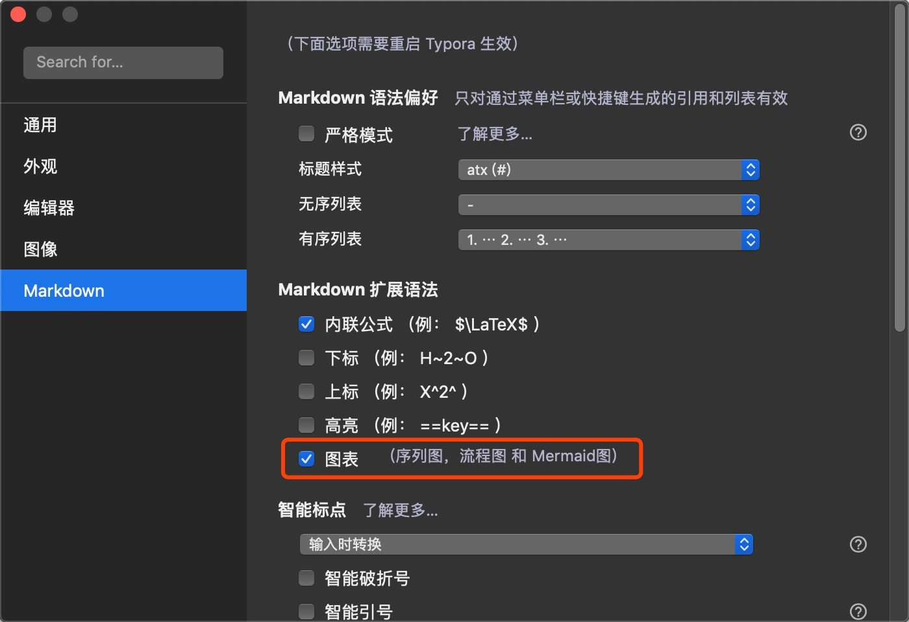

# markdown
markdown是一个程序员必备记笔记的工具，它支持windows,linux,max而且适用于很多的场合，清量、美观是它的优点
# markdown：

[TOC]

+ #### [markdown基础技巧](markdown.md)

+ #### [markdown高级技巧](高级技巧.md)

+ #### [markdown数学符号](math数学符号.md)

+ #### [markdown流程图](1.md)

+ #### [markdown字体字号](2.md)

+ ### [markdown脚注](3.md)


> 我们可以用markdown还能做些什么？

1. [slidev](slidev.md)使用markdown做出精美的PPT
2. [VuePress](https://github.com/3293172751/vuepress)做出精美的文档
3. [Markmap](markmap.md)做出好看的流程图


## 1. 前言

Markdown 的原生语法不支持绘制图形，但通过 Mermaid 扩展，我们可以将一些格式化的文字渲染成我们需要的图形。常用的图形有 “流程图”、“时序图”、“类图”、“状态图”、“甘特图”、"饼图" 等。

[Mermaid](https://mermaid-js.github.io/mermaid/#/) 是一个方便于 Markdown 文档撰写者通过文本方式生成图形的扩展工具。相比 Visio 它要轻很多，几行文字便可生成一幅完整且美观的流程图。

本节将重点介绍如何通过 Mermaid 绘制「流程图」。

流程图（flow chart）是体现封闭系统运动状态的有效展示形式，可以让管理者、实现者清晰的认识系统运转流程，也可以直观的描述工作过程。

**环境说明**：
考虑到 Markdown 工具之间的不兼容，有的内容直接从页面复制粘贴到本地不会正常显示，大家学习时自己动手写是肯定没问题的。本节所有实例代码及演示效果均使用 Typora 工具完成。
Mermaid 为 Markdown 扩展语法，需要在 Typora 设置中开启对图表的语法支持。其方式为：「设置」->「Markdown」->「Markdown 扩展语法」-> 勾选「图表」，如下图：



## 2. 语法详解


### 2.1 基本的流程图

流程图由几何图形节点及连接线组成。几何图形节点是流程图内的各元素的载体，通常用形状来区分其属性，例如圆形代表开始或结束、菱形代表判断等。连接线用于描述几何图形节点之间的联系，可能是有向线段，也可能是无向线段等。

在 Markdown 中添加 Mermaid 图形，需要声明 Mermaid 类型的代码块，代码如下：

~~~markdown
```mermaid
<!-- 此处的内容会被渲染成 mermaid 图形 -->
```
代码块123
~~~

基本的流程图包含：流程图布局方向、几何图形和连接线三个部分组成。

**实例 1**：

基本的竖向流程图。

~~~markdown
```mermaid
graph TD
    开始 --> 结束
```
代码块1234
~~~

此部分代码将会渲染成如下效果：


通过修改图表的声明，可以修改流程图的布局方向。例如将上边的流程图转换为横向流程图。

**实例 2**：

基本的横向流程图。

~~~markdown
```mermaid
graph LR
    开始 --> 结束
```
代码块1234
~~~

渲染后效果如下：


支持的方向有：

| 标志 | 方向                  |
| :--- | :-------------------- |
| TB   | top bottom - 从上到下 |
| BT   | bottom top - 从下到上 |
| RL   | right left - 从右到左 |
| LR   | left right - 从左到右 |
| TD   | 等同于 TB             |


### 2.2 几何图形节点

#### 2.2.1 默认的节点

几何图形节点是流程图中的核心元素，其要素包括形状和内容。

在 Mermaid 语法中，不加任何修饰的文字内容会被渲染成几何图形节点。

**实例 3**：

默认的几何图形。

~~~markdown
```mermaid
graph LR
    几何图形中的文本内容
```
代码块1234
~~~

其渲染结果如下：


#### 2.2.2 分离节点的 ID 与内容

在相对复杂的场景中，同一图形可能被多次引用，如果图形中的文本较长，或者文本内容不足以体现图形的唯一性，可将图形节点的 ID 与其文本内容分开定义，以使结构更加清晰。

**实例 4**：

将节点的 ID 和显示文本区分开。

~~~markdown
```mermaid
graph LR
    一号节点[在此输入希望在一号节点上显示的文字内容]
```
代码块1234
~~~

其渲染结果如下：


#### 2.2.3 节点的形状

形状可用于区分节点的不同属性，有利于丰富流程图的信息量，同时保持其简洁性。

在 Mermaid 中可以使用一些基本符号定义节点的形状，例如：圆角形、跑道形、气缸形、非对称形状、菱形、六角形、平行四边形、梯形。

**实例 5**：

- 圆角形节点的语法。

~~~markdown
```mermaid
graph TD
	节点ID(节点显示文本)
```
代码块1234
~~~


- 圆形节点的语法。

~~~markdown
```mermaid
graph TD
	节点ID((节点显示文本))
```
代码块1234
~~~


- 非对称形节点的语法。

~~~markdown
```mermaid
graph TD
	节点ID>节点显示文本]
```
代码块1234
~~~


- 菱形节点的语法。

~~~markdown
```mermaid
graph TD
	节点ID{节点显示文本}
```
代码块1234
~~~


- 六角形节点的语法。

~~~markdown
```mermaid
graph TD
	节点ID{{节点显示文本}}
```
代码块1234
~~~


- 平行四边形节点的语法。

~~~markdown
```mermaid
graph TD
	右倾平行四边形[/平行四边形--右倾/]
	左倾平行四边形[\平行四边形--左倾\]
```
代码块12345
~~~


- 梯形节点的语法。

~~~markdown
```mermaid
graph TD
  梯形[/梯形--正向\]
	反向梯形[\梯形--反向/]
```
代码块12345
~~~


### 2.3 连接线

#### 2.3.1 基本连接线

在流程图中，不同节点之间需要通过连接线来描述其相关性。

**实例 6**：

基本的连接线语法。

~~~markdown
```mermaid
graph LR
    A-->B
```
代码块1234
~~~

其渲染结果如下：


#### 2.3.2 连接线的种类

不同种类的连接线可以表示不同类型的关系，例如，无方向的连接线可用来表示相关性、有方向的连接线可以表示数据流向或者节点间的依赖关系；用实线表示强关联、用虚线表示弱关联等待。

**实例 7**：

无向线段连接线。

~~~markdown
```mermaid
graph LR
    A --- B -- 带文字连接线 --- C
```
代码块1234
~~~


点状连接线。

~~~markdown
```mermaid
graph LR
    A -.- B -. 带文字连接线 .-> C
```
代码块1234
~~~


粗实连接线。

~~~markdown
```mermaid
graph LR
    A ==> B == 带文字连接线 ==> C
```
代码块1234
~~~


### 2.4 视图分组

对于相对庞大的流程图，可以通过对视图分组，以区分体系内的不同模块，以及不同模块间的关联关系。

**实例 8**：

视图分组。

~~~markdown
```mermaid
graph TB
    c1-->a2
    subgraph 第一组
    a1-->a2
    end
    subgraph 第二组
    b1-->b2
    end
    subgraph 第三组
    c1-->c2
    end
```
代码块12345678910111213
~~~


其渲染结果如下：


## 3. 使用场景及实例

流程图常用于项目的需求分析和设计阶段，也较常出现于程序使用手册中。

**实例 9**：

冒泡排序流程图。

~~~markdown
```mermaid
graph LR
	执行1[i = 1]
  执行2[j = 0]
  执行3[i ++]
  执行4["a = arr[j], b = arr[j + 1]"]
  执行5[交换 a, b]
  执行6[j ++]
	判断1["i < n"]
	判断2["j < n - i"]
  判断3["a > b"]
  开始 --> 执行1
  执行1 --> 判断1
  判断1 --Y--> 执行2
  执行2 --> 判断2
  判断2 --Y--> 执行4
  判断2 --N--> 执行3
  执行3 --> 判断1
  执行4 --> 判断3
  判断3 --N--> 判断2
  判断3 --Y--> 执行5
  执行5 --> 执行6
  执行6 --> 判断2
  判断1 --N--> 结束
```
代码块12345678910111213141516171819202122232425
~~~

渲染效果如下：


## 4. 小结

- Mermaid 为 Markdown 提供了文本转换为图形的扩展功能；
- Mermaid 方式渲染的流程图包含布局方向、图形节点和连接线三个基本要素；
- Mermaid 流程图支持多种节点形状、连接线种类，可以使流程图具有丰富的表现力。

[)

<!--downmarkdown也是我刚上手不久的一款笔记软件-->

对于markdown，是一个是个轻度排版，:smile:重度内容的软件，关于typora它也是特别简介的。

从我自己的角度上面，比较喜欢的OneNote，markdown，GitHub，vim，同样的，也有很多丰富的插件。

对于代码来说，无疑markdown是最好的选择之一，可以看下**C++**的代码模板：

```c++
#include<iostream>`

`uring namespace std;`

`int main()`

`{`

​		`cout<<"hello word"<<endl;`

​		`return 0;`

`}
```

mark down支持六种标题，分别对应的不同的样式。

------

###  *怎么*使用？

如果不算**扩展**，Markdown的语法绝对**简单**到让你爱不释手。

Markdown语法主要分为如下几大部分： **标题**，**段落**，**区块引用**，**代码区块**，**强调**，**列表**，**分割线**，**链接**，**图片**，**反斜杠 `\`**，**符号'`'**。

####  1.标题

两种形式：
1）使用`=`和`-`标记一级和二级标题。

> 一级标题
> `=========`
> 二级标题
> `---------`

效果：

> # 一级标题
>
> ## 二级标题

2）使用`#`，可表示1-6级标题。

> \# 一级标题
> \## 二级标题
> \### 三级标题
> \#### 四级标题
> \##### 五级标题
> \###### 六级标题

效果：

> # 一级标题
>
> ## 二级标题
>
> ### 三级标题
>
> #### 四级标题
>
> ##### 五级标题
>
> ###### 六级标题

#### 2 段落

段落的前后要有空行，所谓的空行是指没有文字内容。若想在段内强制换行的方式是使用**两个以上**空格加上回车（引用中换行省略回车）。

#### 3 区块引用

在段落的每行或者只在第一行使用符号`>`,还可使用多个嵌套引用，如：

> \> 区块引用
> \>> 嵌套引用

效果：

> 区块引用
>
> > 嵌套引用

#### 4 代码区块

代码区块的建立是在每行加上4个空格或者一个制表符（如同写代码一样）。如
普通段落：

void main()
{
	printf("Hello, Markdown.");
}

代码区块：

```c
void main()
{
    printf("Hello, Markdown.");
}
```

**注意**:需要和普通段落之间存在空行。

#### 5 强调

在强调内容两侧分别加上`*`或者`_`，如：

> *斜体*，_斜体_
> **粗体**，__粗体__

效果：

> *斜体*，*斜体*
> **粗体**，**粗体**

#### 6 列表

使用`·`、`+`、或`-`标记无序列表，如：

> -（+*） 第一项 -（+*） 第二项 - （+*）第三项

**注意**：标记后面最少有一个_空格_或_制表符_。若不在引用区块中，必须和前方段落之间存在空行。

效果：

> - 第一项
> - 第二项
> - 第三项

有序列表的标记方式是将上述的符号换成数字,并辅以`.`，如：

> 1 . 第一项
> 2 . 第二项
> 3 . 第三项

效果：

> 1. 第一项
> 2. 第二项
> 3. 第三项

#### 7 分割线

分割线最常使用就是三个或以上`*`，还可以使用`-`和`_`。

#### 8 链接

链接可以由两种形式生成：**行内式**和**参考式**。
**行内式**：

> [smile的Markdown库](https://github.com/3293172751 "Markdown")。

效果：

> [smile的Markdown库](https://github.com/3293172751)。

**参考式**：

> [smile的Markdown库1][1]
> [smile的Markdown库2][2]
>
> [1]: https://github.com/3293172751	"Markdown"
> [2]: https://github.com/329172751	"Markdown"

效果：

> [smile的Markdown库1](https://github.com/3293172751)
> [smile的Markdown库2](https://github.com/3293172751)

**注意**：上述的`[1]:https:://github.com/3293172751 "Markdown"`不出现在区块中。

#### 9 图片

添加图片的形式和链接相似，只需在链接的基础上前方加一个`！`。

#### 10 反斜杠`\`

相当于**反转义**作用。使符号成为普通符号。


#### 11 符号'`'

起到标记作用。如：

> ```
> ctrl+a
> ```

效果：

> ```
> ctrl+a
> ```


####  尝试一下

- **Chrome**下的插件诸如`stackedit`与`markdown-here`等非常方便，也不用担心平台受限。
- **在线**的dillinger.io评价也不错
- **Windowns**下的MarkdownPad也用过，不过免费版的体验不是很好。
- **Mac**下的Mou是国人贡献的，口碑很好。
- **Linux**下的ReText不错。

**当然，最终境界永远都是笔下是语法，心中格式化 :)。**

------

**注意**：不同的Markdown解释器或工具对相应语法（扩展语法）的解释效果不尽相同，具体可参见工具的使用说明。 虽然有人想出面搞一个所谓的标准化的Markdown，[没想到还惹怒了健在的创始人John Gruber] (http://blog.codinghorror.com/standard-markdown-is-now-common-markdown/ )。

------

以上基本是所有traditonal markdown的语法。


### 其它：

列表的使用(非traditonal markdown)：

用`|`表示表格纵向边界，表头和表内容用`-`隔开，并可用`:`进行对齐设置，两边都有`:`则表示居中，若不加`:`则默认左对齐。

| 代码库       | 链接                          |
| ------------ | ----------------------------- |
| MarkDown     | https://github.com/3293172751 |
| MarkDownCopy | https://github.com/3293172751 |

关于其它扩展语法可参见具体工具的使用说明。


### 表情：

在window或者Linux又或者是max同样有一个让人惊喜的功能，简单试一下

`：输入你要输入的英文或者数字`

:smile

或者用快捷键**win + 。**😊这是Windows自带的表情标签


### markdown插入图片：

markdown插入图片是一个很特别的功能，并不仅仅是你复制粘贴所得到的那么简明。

它复杂的功能带来了更好的体验。

**在你引用本地图片的时候，如果将图片删除后，那么你的图片也会消失**，这样会增加很多的维护成本。

如何解决:frowning::

-   你可以选择网上的图片路径，对路径的地址进行拷贝，在粘贴为图像路径，基本上图片不会失效。
-   图床思想：
    -   PicGo   --适用于windows


###### 图片的排版：

​		使用HTML对图片基本操作


------

### 同样要补充的是：

​		在你使用GitHub做笔记，上传项目，或者是做个人博客的时候，GitHub一般选择的是图床，即你不会将GitHub上面的图片。

而是一般选择将你的图片上传到一个服务器或者是上传到一个平台，使用`特有的连接`去访问。

关于GitHub的Pic Go仓库是一个开源的，可以免费使用的仓库。

PicGo-Setup下载之后即可直接进行安装，使用，你就不用担心自己的GitHub或者你的博客卡顿问题了

[这个是GitHub上面的下载地址：https://github.com/Molunerfinn/PicGo/releases/download/v2.3.0/PicGo-Setup-2.3.0-x64.exe](https://github.com/Molunerfinn/PicGo/releases/download/v2.3.0/PicGo-Setup-2.3.0-x64.exe)


你可以使用你的GitHub用来存放图片，但是我不建议这么做，GitHub在国内的下载速度很慢，可能会出现图片加载速度缓慢的情况😂
